# Thiết kế dữ liệu
## Diagram cấu trúc project

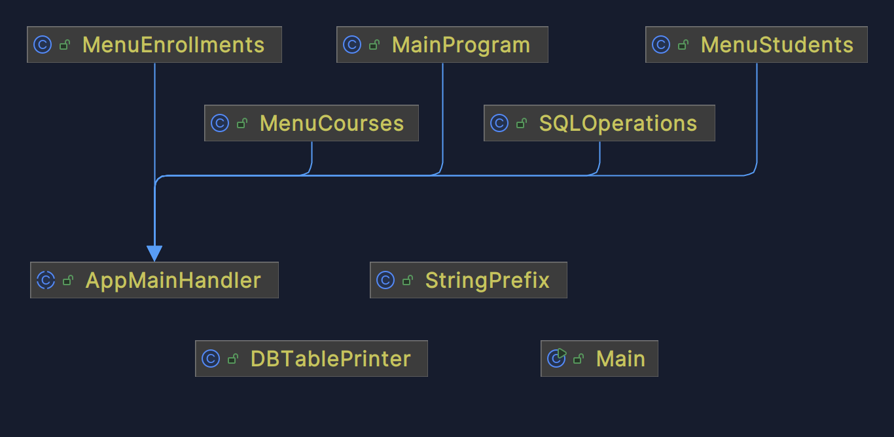
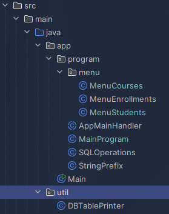
```text
Cấu trúc project
└── src/
    └── main/
        └── java/
            ├── app/
            │   ├── program/
            │   │   ├── menu/
            │   │   │   ├── MenuCourses.java
            │   │   │   ├── MenuEnrollments.java
            │   │   │   └── MenuStudents.java
            │   │   ├── AppMainHandler.java
            │   │   ├── MainProgram.java
            │   │   ├── SQLOperations.java
            │   │   └── StringPrefix.java
            │   └── Main.java
            └── util/
                └── DBTablePrinter.java
```
- **Main:** File chứa hàm main
- **AppMainHandler (abstract):** Chứa code để kết nối với database
  - **MainProgram:** Chứa menu chính
  - **MenuStudents:** Chứa menu thông tin sinh viên và các tác vụ liên quan 
  - **MenuCourses:** Chứa menu thông tin môn học và các tác vụ liên quan 
  - **MenuEnrollments:** Chứa menu thông tin ghi danh và các tác vụ liên quan
  - **SQLOperations:** Chứa các tác vụ SQL để thêm, sửa hoặc xóa dữ liệu
- **StringPrefix:** Class dùng để chứa các hàm thêm tiền tố vào chuỗi
- **DBTablePrinter:** Class dùng để in bảng ra console

## Diagram database
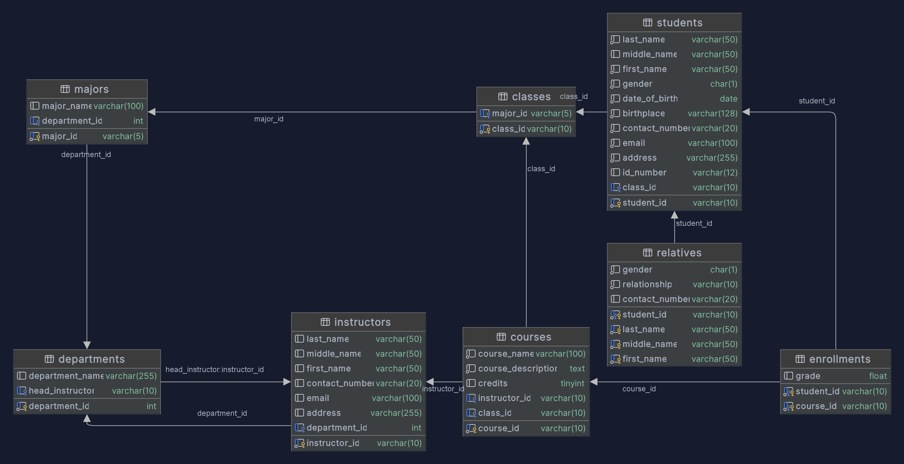
- **students:** Thông tin sinh viên
  - **students_id (Khóa chính):** Mã số sinh viên 
  - **last_name:** Tên họ 
  - **middle_name:** Tên lót
  - **first_name:** Tên
  - **gender:** Giới tính
  - **date_of_birth:** Ngày sinh
  - **birthplace:** Quê quán
  - **contact_number:** Số điện thoại
  - **email:** Email
  - **address:** Địa chỉ nhà
  - **id_number:** Số căn cước công dân
  - **class_id (Khóa ngoại -> class_id bảng classes):** Mã lớp
- **courses:** Thông tin môn học
  - **course_id (Khóa chính):** Mã môn hoọc
  - **course_name:** Tên môn học
  - **course_description:** Mô tả môn học
  - **credits:** Tín chỉ
  - **instructor_id (Khóa ngoại -> instructor_id bảng instructors):** Mã số giảng viên
  - **class_id (Khóa ngoại -> class_id bảng classes):** Mã lớp
- **enrollments:** Thông tin ghi danh
  - **Khóa chính:**
    - **student_id (Khóa ngoại -> student_id bảng students):** Mã số sinh viên
    - **course_id (Khóa ngoại -> course_id bảng courses):** Mã môn học
  - **grade:** Điểm môn học của sinh viên đó
- **relatives:** Thông tin người thân của sinh viên
  - **Khóa chính:**
    - **student_id (Khóa ngoại -> student_id bảng students:** Mã số sinh viên
    - **last_name:** Tên họ 
    - **middle_name:** Tên lót
    - **first_name:**  Tên
  - **gender:** Giới tính
  - **relationship:** Mối quan hệ
  - **contact_number:** Số điện thoại
- **classes:** Thông tin lớp
  - **class_id (Khóa chính):** Mã lớp
  - **major_id (Khóa ngoại -> major_id bảng majors):** Mã chuyên ngành
- **majors:** Các chuyên ngành
  - **major_id (Khóa chính):** Mã chuyên ngành
  - **major_name:** Tên chuyên ngành
  - **department_id (Khóa ngoại -> department_id bảng departments):** Mã khoa 
- **departments:** Khoa
  - **department_id (Khóa chiính):** Mã khoa
  - **department_name:** Tên khoa
  - **head_instructor (Khóa ngoại -> instructor_id bảng instructor):** Mã số giảng viên là trường phòng khoa này
- **instructors:** Thông tin giảng viên
  - **instructor_id (Khóa chính):** Mã số giảng viên
  - **last_name:** Tên họ
  - **middle_name:** Tên lót
  - **first_name:** Tên
  - **contact_number:** Số điện thoại
  - **email:** Email
  - **address:** Địa chỉ nhà
  - **department_id (Khóa ngoại -> department_id bảng departments):** Mã khoa

# Thiết kế xử lí
- **AppMainHandler (abstract):** Chứa code để kết nối với database
```java
package app.program;

import java.sql.Connection;
import java.sql.DriverManager;
import java.sql.SQLException;
import java.util.Scanner;

public abstract class AppMainHandler {
    // Gọi các thuộc tính static username, password để đăng nhập
    protected static String username;
    protected static String password;
    protected static Connection connection;

    // Hàm đăng nhập vào cơ sở dữ liệu
    public static void login() {
        Scanner sc = new Scanner(System.in);
        sc.useDelimiter("\\n");
        System.out.println("Đăng nhập vào database");
        while(true) {
            // Người dùng nhập thông tin đăng nhập
            System.out.print("Username: ");
            username = sc.next();
            sc.nextLine();
            System.out.print("Password: ");
            password = sc.next();
            sc.nextLine();
            if (connectionTest()) { // Nếu nhập đúng thông tin đăng nhập => Kết nối thành công
                System.out.println("\n🟢 Kết nối database thành công");
                break;
            }
            else { // Nếu nhập sai thông tin đăng nhập => Thử lại
                System.out.println("\n🔴 Không kết nối được database, kiểm tra lại thông tin đăng nhập");
            }
        }
    }

    // Hàm đóng kết nối tới cơ sở dữ liệu
    public static void closeConnection() {
        try {
            connection.close();
            System.out.println("\nĐã ngắt kết nối tới database");
        } catch (SQLException e) {
            throw new RuntimeException(e);
        }
    }

    // Hàm tạo kết nối tới cơ sở dữ liệu
    public static boolean connectionTest() {
        try {
            // url = đường liên kết cơ sở dữ liệu sử dụng driver JDBC MySQL
            String url = "jdbc:mysql://localhost:3306/javasqlcuoiki";
            // Tạo kết nối tới cơ sở dữ liệu sử dụng url, username, password
            connection = DriverManager.getConnection(url, username, password);
            return true;
        } catch (SQLException e) {
            return false;
        }
    }
}
```

# Demo
## Tình trạng các chức năng
| STT | Chức năng | Mức độ hoàn thành | Ý nghĩa |
|-----|-----------|-------------------|---------|
| 1   |           |                   |         |
| 2   |           |                   |         |
| 3   |           |                   |         |
| 4   |           |                   |         |

## Chạy demo
| 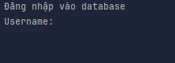 |
|-------------------------------------------|
| *Menu đăng nhập*                          |

| 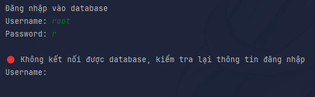 |
|---------------------------------------------|
| *Báo lỗi khi không đăng nhâp được*          |

| 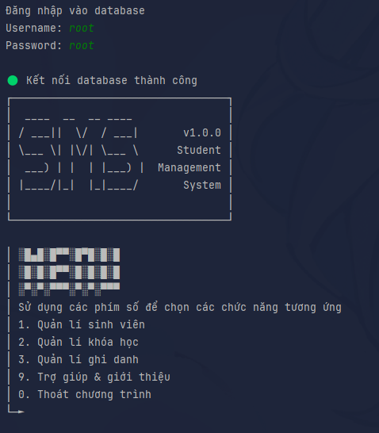 |
|----------------------------------------------|
| *Đăng nhập thành công*                       |

| 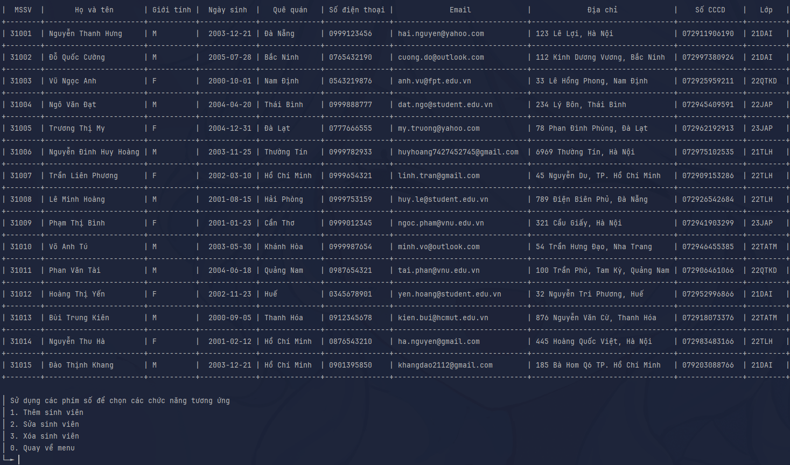 |
|----------------------------------------------|
| *Menu quản lí sinh viên*                     |

| 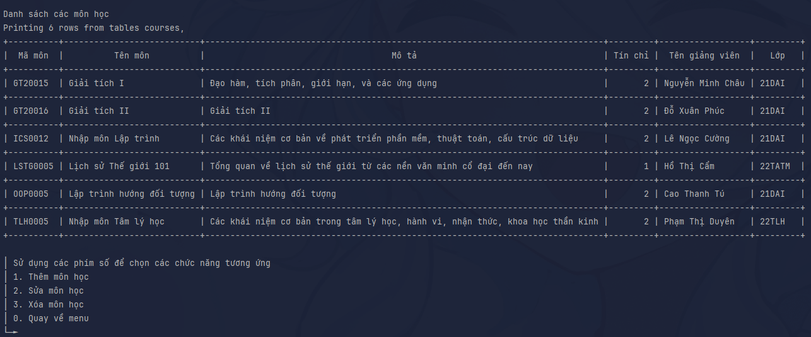 |
|---------------------------------------------|
| *Menu quản lí môn học*                      |

| 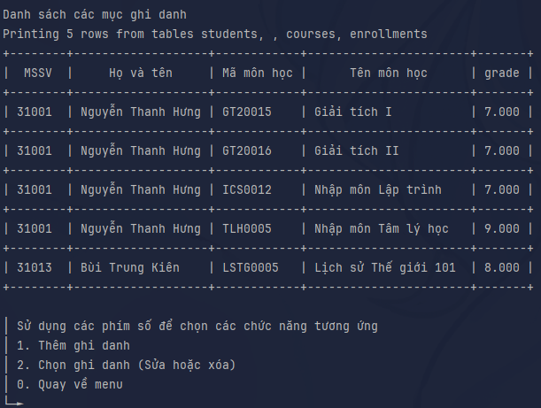 |
|-------------------------------------------------|
| *Menu quản lí ghi danh*                         |

| 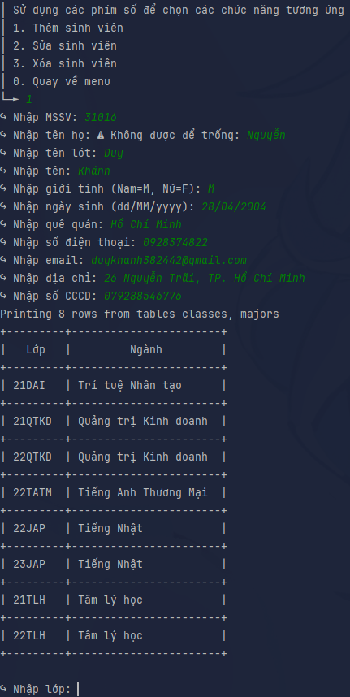 |
|-----------------------------------------------|
| *Nhập một sinh viên mới*                      |

| 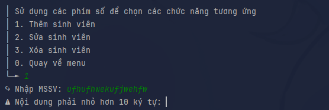           |
|----------------------------------------------------------------------|
| *Báo lỗi khi nhập dữ liệu không đúng yêu cầu khi thêm sinh viên mới* |

# Tổng kết
## Các kết quả đã thực hiện
- Tạo kết nối tới cơ sở dữ liệu sử dụng JDBC MySQL driver
- Thêm, chọn, sửa và xóa thông tin sinh viên, thông tin môn học và thông tin ghi danh
- Xử lí các ngoại lệ khi người dùng nhập không đúng yêu cầu
## Đánh giá ưu khuyết điểm
- Ưu điểm:
  - Có phân bố cấu trúc thư mục và packages trong project
  - Thiết kế cơ sở dữ liệu có cấu trúc logic
- Nhược điểm:
  - Source code khá bừa bộn, khó để maintain
    - Các check được thực hiện trên chương trình thay vì qua SQL nên làm codebase rất bloated
    - Các phần code có thể được refactor lại thành hàm để làm gọn
  - Các thuộc tính trong bảng trong cơ sở dữ liệu chưa có ràng buộc dữ liệu
## Hướng mở rộng trong tương lai
- Cần test nhiều hơn để xử lí nhiều ngoại lệ hơn
- Viết lại các hàm nhập và xuất
- Làm gọn lại cấu trúc project